# TOPO — Social App for the Outdoors

> *Premium dark-mode social prototype for hikers, climbers, runners and rangers.*  
> Built with React (Vite) + Tailwind CSS v4 + Framer Motion + Lucide icons.

---

## Quick Start

```bash
# 1. Install dependencies
npm install

# 2. Start the development server
npm run dev

# 3. Open in your browser
# http://localhost:5173
```

```bash
# Build for production
npm run build

# Preview the production build
npm run preview
```

> **Requirements:** Node.js 18+ and npm 9+

---

## Screenshots

### Welcome & Sign Up

| Welcome | Sign Up |
|---------|---------|
| 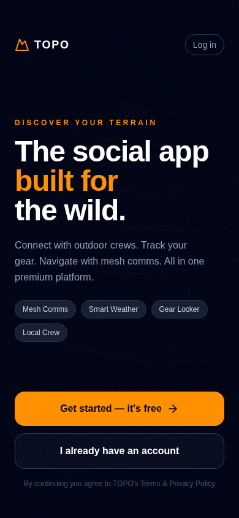 | 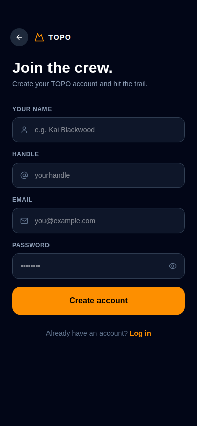 |

The welcome screen features an animated topographic map background with the TOPO logo in SAR Orange (#ff9100). Users can sign up or log in — all session data is persisted to localStorage.

---

### Customise

| Preset selection | Options expanded |
|-----------------|-----------------|
| 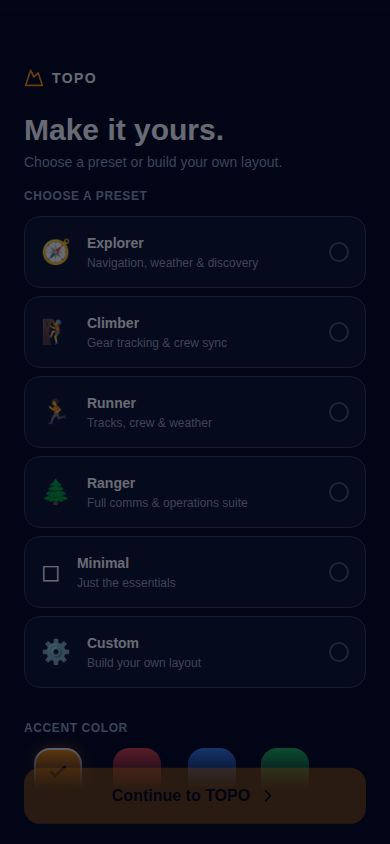 | 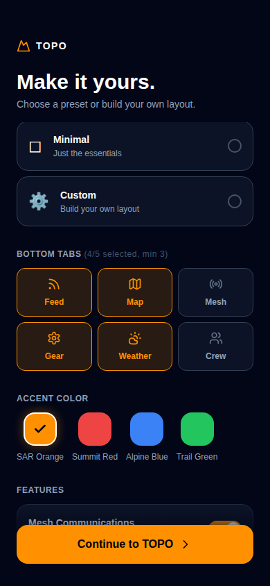 |

After signing up, users land on the Customize screen. Choose from five presets or build a fully custom layout:

- **Presets:** Explorer, Climber, Runner, Ranger, Minimal — each with its own accent colour and tab set
- **Custom tabs:** Pick 3–5 tabs from Feed, Map, Mesh, Gear, Weather, Crew
- **Accent colour:** SAR Orange, Summit Red, Alpine Blue, or Trail Green
- **Feature toggles:** Mesh comms, weather alerts, gear reminders, crew location sharing

---

### Main Feed

| Top of feed | Scrolled feed |
|-------------|---------------|
| 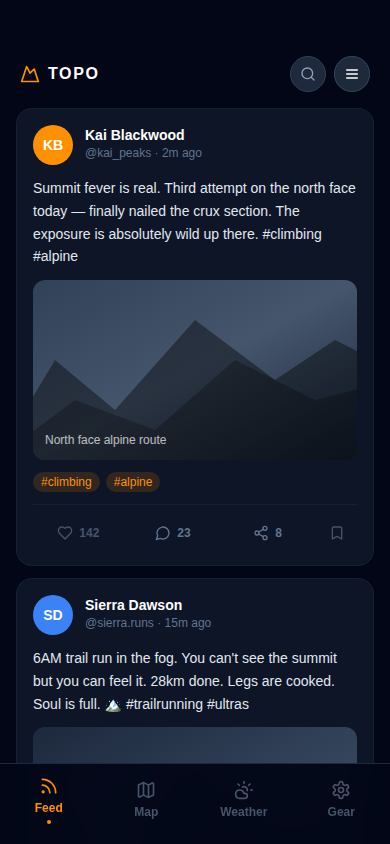 | 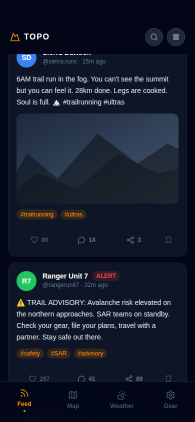 |

A Twitter/Instagram-style social feed with **22 mock posts** from the outdoor community. Features:

- Avatar, handle, timestamp and like/comment/share counts on every post
- Mountain-silhouette post images generated from CSS gradients
- Tag pills with accent-colour tinting
- Safety `ALERT` badge on advisory posts
- Interactive like ❤️ (toggling fill + count) and bookmark 🔖 buttons

---

### Side Drawer (Hamburger Menu)

| Side drawer open |
|-----------------|
| 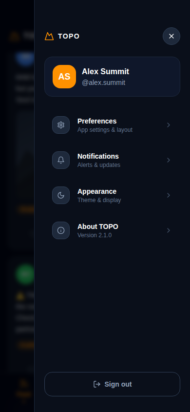 |

Tap the ☰ icon (top-right of any screen) to open the slide-in side drawer:

- User profile card with avatar and handle
- Navigation items: Preferences, Notifications, Appearance, About TOPO
- Sign out button at the bottom

---

### Dashboard (Gear / Widgets)

| Dashboard | Edit mode |
|-----------|-----------|
| 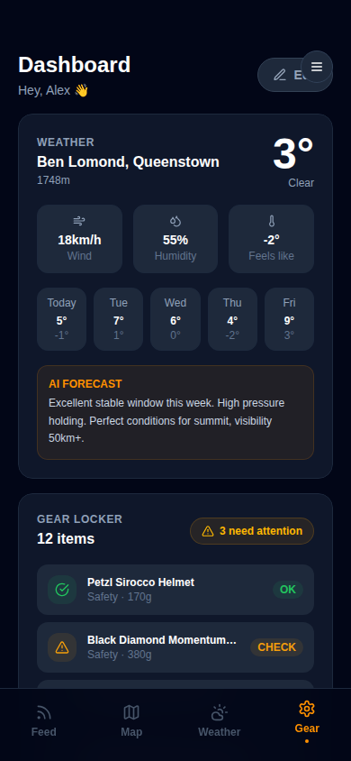 | 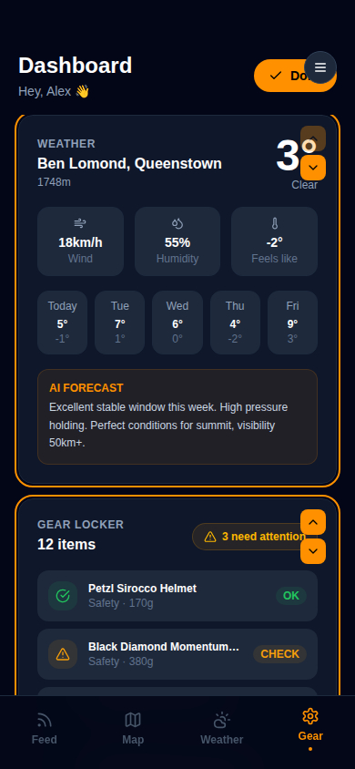 |

The modular dashboard contains three widget types, each independently scrollable. Tap **Edit** to enter edit mode — widgets gain an SAR Orange highlight and ↑/↓ reorder controls.

#### Weather Widget
- Current temperature, condition, wind speed, humidity, feels-like
- 5-day mini forecast strip
- AI summary panel with route-specific recommendations

#### Gear Locker Widget
- **12 items** with safety status (`OK` / `CHECK` / `LOW FUEL`)
- Colour-coded status badges (green / amber / red)
- Expandable to show all items

#### Local Crew Widget
- **5 nearby members** with distance, last-seen time, and activity
- Live-status dot (green = active/moving)
- Mesh Active indicator

---

### Mesh Mode

| Radar view | Burst chat |
|-----------|-----------|
| 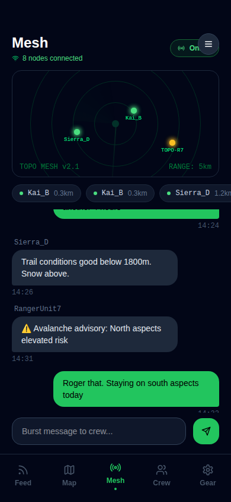 | 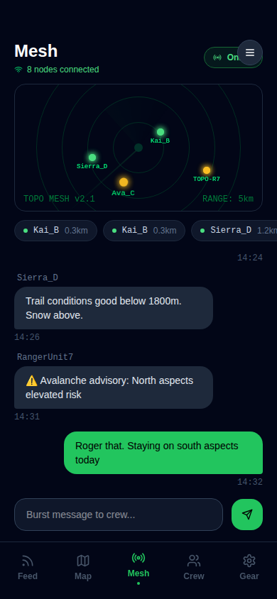 |

A radical UI shift from the social feed. The Mesh screen simulates peer-to-peer BLE communication without cell service:

- **Radar display** with animated scanning sweep and range rings
- **5 P2P nodes** appear progressively with signal-strength colour coding (green > amber > red)
- **BitChat-style burst messaging** — type a message and the crew replies automatically
- Online/Offline toggle to simulate connectivity state changes

---

### Weather Screen

| Full weather |
|-------------|
| 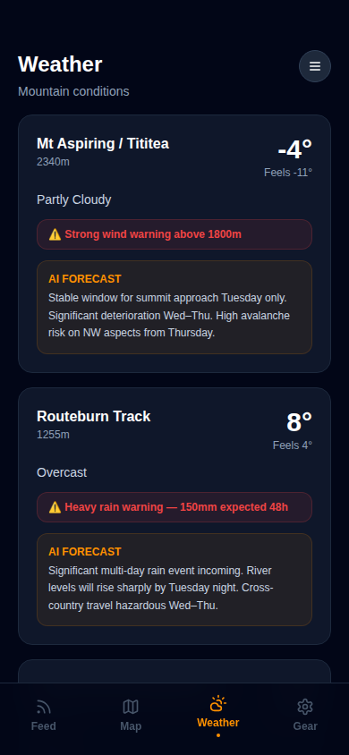 |

Detailed weather for **5 New Zealand mountain locations**:

1. Mt Aspiring / Tititea — 2340m
2. Routeburn Track — 1255m
3. Ben Lomond, Queenstown — 1748m
4. Tongariro Alpine Crossing — 1967m
5. Mueller Hut, Aoraki/Mt Cook — 1800m

Each location card shows temperature, wind, humidity, multi-day forecast, active alerts, and an AI-synthesised summary.

---

### Crew Screen

| Crew nearby |
|------------|
| 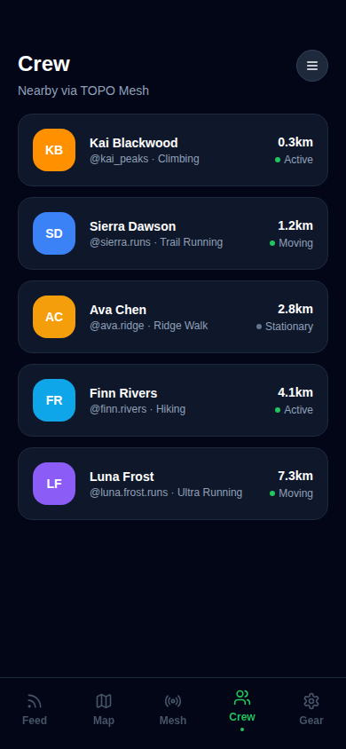 |

Lists all nearby crew members connected via the TOPO Mesh, with distance, activity type, and last-seen time.

---

## Feature Overview

| Feature | Status |
|---------|--------|
| Welcome / hero screen with animated topo background | ✅ |
| Sign up & Log in screens (localStorage persistence) | ✅ |
| Customize screen — 5 presets + fully custom | ✅ |
| Dynamic bottom toolbar based on customization | ✅ |
| Accent colour theming (CSS variable `--accent`) | ✅ |
| Feature toggles (mesh, alerts, reminders, crew) | ✅ |
| Main social feed — 22+ mock posts | ✅ |
| Post interactions (like, bookmark) | ✅ |
| Hamburger menu / side drawer | ✅ |
| Dashboard with 3 widget types | ✅ |
| Dashboard edit mode with simulated reordering | ✅ |
| Gear Locker — 12 items with safety status | ✅ |
| Weather — 5 locations with AI summary | ✅ |
| Local Crew widget — 5 nearby members | ✅ |
| Mesh mode — radar animation + node discovery | ✅ |
| BitChat burst messaging | ✅ |
| Framer Motion screen transitions | ✅ |
| localStorage session persistence (sign-in survives refresh) | ✅ |
| `src/mockDatabase.js` with required data | ✅ |

---

## Tech Stack

| Package | Version | Purpose |
|---------|---------|---------|
| React | 18.3.1 | UI framework |
| Vite | 5.4 | Build tool / dev server |
| Tailwind CSS | v4 | Utility-first styling |
| `@tailwindcss/vite` | v4 | Tailwind v4 Vite plugin |
| Framer Motion | 11 | Smooth screen transitions |
| lucide-react | 0.400 | All icons |

---

## Project Structure

```
topo/
├── public/
│   └── vite.svg
├── src/
│   ├── App.jsx                    # Root — routing between screens
│   ├── main.jsx                   # React entry point
│   ├── index.css                  # Global styles + CSS variables
│   ├── mockDatabase.js            # 22 posts, 12 gear items, 5 weather
│   ├── components/
│   │   ├── BottomNav.jsx          # Dynamic bottom toolbar
│   │   ├── PostCard.jsx           # Individual feed post
│   │   ├── SideDrawer.jsx         # Hamburger side menu
│   │   └── widgets/
│   │       ├── WeatherWidget.jsx  # Dashboard weather tile
│   │       ├── GearWidget.jsx     # Gear locker widget
│   │       └── CrewWidget.jsx     # Local crew widget
│   └── screens/
│       ├── Welcome.jsx            # Hero screen with topo background
│       ├── Auth.jsx               # Sign up / Log in
│       ├── Customize.jsx          # Presets + custom layout builder
│       ├── MainApp.jsx            # Tab shell + hamburger
│       ├── Feed.jsx               # Social feed
│       ├── Dashboard.jsx          # Widget grid with edit mode
│       └── Mesh.jsx               # Radar + BitChat
├── screenshots/                   # App screenshots
├── index.html
├── vite.config.js
└── package.json
```

---

## Design System

| Token | Value |
|-------|-------|
| Background (deep) | `#020617` (slate-950) |
| Surface | `#0f172a` (slate-900) |
| Card | `#1e293b` (slate-800) |
| SAR Orange (default accent) | `#ff9100` |
| Text primary | `#ffffff` |
| Text muted | `#94a3b8` (slate-400) |
| Font | System UI / SF Pro Display |

Accent colour is controlled by a single CSS custom property `--accent` on `:root`, updated at runtime when the user changes their colour preference. All accent-dependent colours (`--accent-dim`, `--accent-rgb`) are derived automatically in `App.jsx`.

---

## Data

`src/mockDatabase.js` exports:

- **`mockPosts`** — 22 posts from hikers, climbers, runners, rangers, and SAR teams
- **`mockGearItems`** — 12 items with name, category, weight, status, last-check date, and notes
- **`mockWeather`** — 5 New Zealand mountain locations with full 5-day forecast, wind data, alerts, and AI summaries
- **`mockCrewMembers`** — 5 nearby users with distance, status, and activity type

---

## Onboarding Flow

1. **Welcome** → tap *Get Started* or *Log in*
2. **Auth** → fill name / handle / email / password → *Create account* (mocked, 800ms delay)
3. **Customize** → pick a preset or build custom layout → *Continue to TOPO*
4. **Main App** → dynamic tabs based on your customization

On subsequent visits, localStorage restores user + customization and skips straight to the app.
